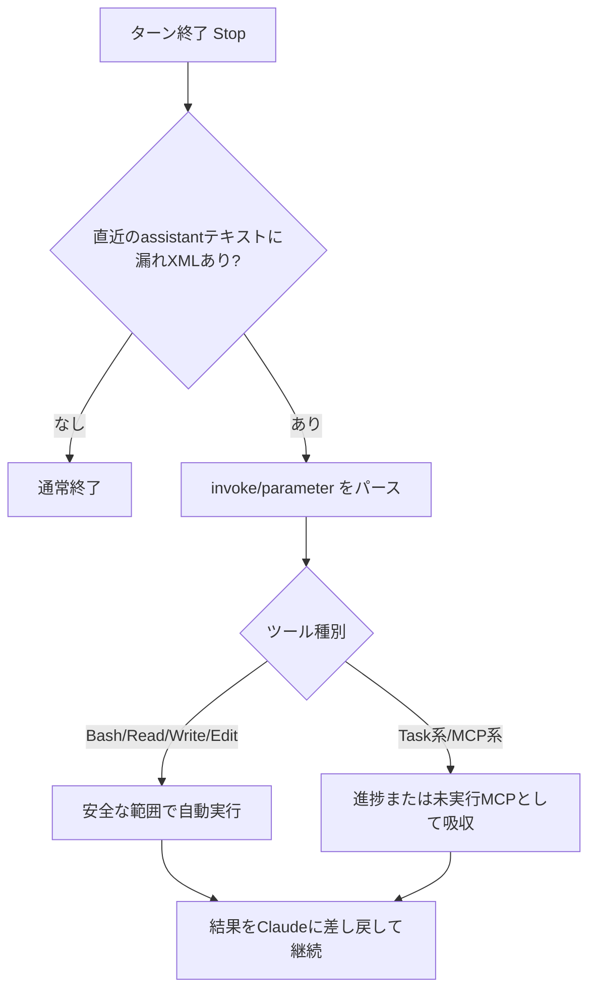

<div align="center">

# claude-code-stall-recover-kit

### Claude Code の「ツール呼び出しXML漏れ」によるストールを検知・自動復旧する防御フック集

[](hooks/stall_recover.py)
[](settings.snippet.json)
[](install.ps1)
[](LICENSE)

**長時間セッションで稀に起きる「ツール呼び出しがテキスト化して止まる」現象を、Stopフックで検知し自動で立て直す**

English version: [README_en.md](README_en.md)

---

</div>

## 概要

Claude Code は、まれにネイティブのツール呼び出しの代わりに、レガシーなXML形式のツール呼び出し（`call` / `<invoke name="Bash">` など）を**アシスタントのテキストとして出力**してしまうことがある。テキストなので実際には実行されず、ターンが止まったように見える（＝ストール）。

このリポジトリは、その失敗モードに対する防御フック一式をまとめたもの。**心がけではなく仕組み**で、漏れの発生確率を下げ、起きても自動で復旧させる。

## 特徴

| 項目 | 内容 |
|---|---|
| 検知 | Stopフックで漏れたXMLツール呼び出しを検出 |
| 自動処理 | 漏れた `Bash` / `Read` / `Write` / `Edit` を可能な範囲で自動実行 |
| MCP漏れ対策 | `mcp__win-control__clipboard_set/get` はWindows APIで代替実行し、その他MCP漏れは失敗扱いにせず吸収 |
| ループ防止 | `TaskUpdate` 等のTask系漏れは進捗記録として吸収し、ループ化を防ぐ |
| 二重実行防止 | 同一の漏れコマンドが繰り返されても再実行しない（重複排除） |
| 予防ガード | セッション開始・プロンプト送信時に短い注意書きを注入し、漏れ自体を抑制 |
| セッション隔離 | 巨大化し、漏れ履歴が多いセッションは UserPromptSubmit でブロックしてresume継続を止める |
| 耐久性 | Stopフックのブロック上限を引き上げ、長時間セッションでの早期打ち切りを緩和 |

## 仕組み



## ファイル構成

| パス | 役割 |
|---|---|
| `hooks/stall_recover.py` | 漏れXMLをパースして処理する Stopフック |
| `hooks/tool_call_guard.py` | セッション開始 / プロンプト送信 / PostToolBatch の注意書き注入 |
| `hooks/session_health_guard.py` | 汚染済み巨大セッションの継続をブロックする UserPromptSubmit フック |
| `tools/audit_sessions.py` | `~/.claude/projects` の漏れ履歴を監査し、停止中セッションを退避 |
| `settings.snippet.json` | インストールする最小の Claude Code 設定ブロック |
| `install.ps1` | フックを `~/.claude/hooks` にコピーし設定をマージ |
| `tests/test_hooks.py` | フックのスモークテスト |
| `docs/diagnosis.md` | 原因分析メモ |

## インストール

リポジトリのフォルダ内で：

```powershell
powershell -ExecutionPolicy Bypass -File .\install.ps1
```

反映後は Claude Code を再起動するか `/hooks` を開いてフックが読み込まれたか確認する。環境変数の変更は次回の Claude Code 起動後に確実に効く。

## テスト

```powershell
python .\tests\test_hooks.py
```

一時的なトランスクリプトを作って漏れを再現し、Stopフックが処理できるか検証する。

## セッション監査と隔離

今回の `3bac9d8e-9ec4-4cdf-98c7-1be6d5ac4069` のように、巨大化した transcript に壊れたXMLツール呼び出しが何度も残っている場合、根本対応は「そのセッションを直して使い続ける」ではなく「新規セッションへ逃がす」こと。

危険なセッションを一覧する：

```powershell
python .\tools\audit_sessions.py
```

停止済みセッションだけ退避する：

```powershell
python .\tools\audit_sessions.py --quarantine 3bac9d8e-9ec4-4cdf-98c7-1be6d5ac4069
```

active/busy なセッションは、別の破損を避けるため既定では退避しない。Claude Code を終了してから実行する。

## 予防策

これはガードレールであって、セッションを健全に保つことの代替ではない。最も確実な予防は今でも次の通り：

- トランスクリプトが巨大になる前に新しいセッションを始める
- 一度XML漏れが複数回出たセッションはresumeしない
- Bash コマンドは短く保つ
- `;` や `&&` でのコマンド連結を避ける
- 複雑なものや日本語の多い内容は、先にファイルへ書き出す
- アシスタント向けの指示に `call` / `<invoke>` の例を含めない

## ライセンス

[MIT](LICENSE) © 2026 cUDGk
